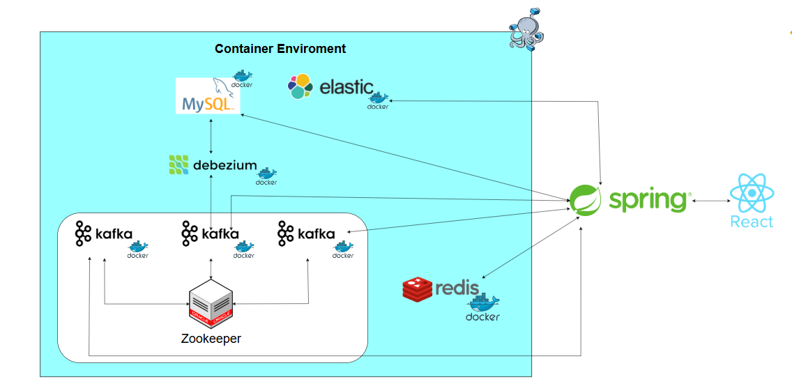

# Fullstack-Course-App

## Overview

Fullstack-Course-App is a version 4 modern, scalable, and robust fullstack application that enables users to register for courses and teachers to post their own courses. The platform supports real-world e-learning scenarios with secure authentication, real-time features, advanced search, integrated VNPay payment gateway, and revenue tracking for administrators.

## Features

- **User Registration for Courses:** Students can browse and enroll in available courses.
- **Teacher Course Management:** Teachers can create, update, and manage their course offerings.
- **Secure VNPay Payment Gateway:** Users can pay for courses securely using the integrated VNPay gateway.
- **Admin Revenue Tracking:** Administrators can track total revenue generated from course enrollments and payments.
- **Real-Time Notifications:** Instant updates via WebSocket for enrollments and announcements.
- **Robust Authentication & Authorization:** Spring Security ensures user data and actions are protected.
- **Scalable Architecture:** Kafka for event-driven processing, Redis for caching, and Elasticsearch for advanced search capabilities.
- **Comprehensive & Smart Search:**  
  Users can quickly find courses using keyword and filter-based search powered by Elasticsearch. The search functionality supports:
    - **Full-text Search:** Search across course titles, descriptions, and tags using natural language queries.
    - **Advanced Filtering:** Filter courses by category, teacher, price, level, and more for precise results.
    - **Smart Recommendations:** The system suggests relevant courses based on course content similarity, categories, and tags, helping users discover related learning opportunities.
    - **Real-time Results:** Search results update instantly as users type, enabled by Elasticsearch’s high-performance indexing.
    - **Typo Tolerance:** Intelligent handling of misspelled words and synonyms to ensure users always find what they’re looking for.
- **Responsive Frontend:** Modern React.js interface with smooth user experience and state management.

## Tech Stack

Frontend: React.js, React Query, Redux  
Backend: Spring MVC, Spring Security, Spring WebSocket, Spring Boot Thymeleaf, Hibernate, Kafka, Elasticsearch, Redis, VNPay  
Database: MySQL

## Architecture


## Getting Started

### Prerequisites

- Node.js and npm (for frontend)
- Java 17+ and Maven (for backend)
- Running instances of MySQL, Redis, Kafka, and Elasticsearch
- VNPay merchant account for payment integration
- Docker & Docker Compose (for containerized deployment)

### Setup Instructions

#### Backend

1. Clone the repository:
    ```bash
    git clone https://github.com/tanle9t2/Fullstack-Course-App.git
    cd Fullstack-Course-App/backend
    ```
2. Configure environment variables and service connections in `application.properties`, including:
    - Database credentials
    - Kafka, Redis, and Elasticsearch endpoints
    - VNPay credentials (provided by VNPay)
3. Build and run the Spring Boot application:
    ```bash
    mvn clean install
    mvn spring-boot:run
    ```

#### Frontend

1. Navigate to the frontend directory:
    ```bash
    cd ../frontend
    ```
2. Install dependencies:
    ```bash
    npm install
    ```
3. Configure API endpoints and VNPay integration settings if required.
4. Start the development server:
    ```bash
    npm start
    ```
    
5. Access the student app at [http://localhost:5173](http://localhost:5173).
6. Access the teacher app at [http://localhost:5174](http://localhost:5174).


### Docker

The project includes Docker support for easy setup and deployment.

#### Requirements

- [Docker](https://docs.docker.com/get-docker/)
- [Docker Compose](https://docs.docker.com/compose/)

#### Steps

1. Make sure you have Docker and Docker Compose installed.
2. In the project root directory, find the provided `docker-compose.yml` file.
3. Adjust environment variables in your `docker-compose.yml` as needed (database passwords, VNPay keys, etc).
4. Start all services with:
    ```bash
    docker-compose up --build
    ```
#### Stopping the Services

To stop all running containers:
```bash
docker-compose down
```
# Debezium MySQL Connector: Step-by-Step Guide (with Postman)

This guide helps you connect Debezium to your MySQL database and Kafka using your provided configuration, and register the connector using Postman.

---

## 1. MySQL Preparation

### A. Create the Debezium User

Run this on your MySQL server (if not already done):

```sql
CREATE USER 'debezium'@'%' IDENTIFIED BY '090224';
GRANT SELECT, RELOAD, SHOW DATABASES, REPLICATION SLAVE, REPLICATION CLIENT ON *.* TO 'debezium'@'%';
FLUSH PRIVILEGES;
```

### B. Enable Binary Logging

In your `my.cnf` (MySQL config file), ensure these lines are present:

```
[mysqld]
server-id=3
log-bin=mysql-bin
binlog-format=ROW
```

Restart MySQL if you made changes.

---

## 2. Debezium Connector Configuration

Use the following JSON as your connector config (`mysql-connector-config.json`):

```json
{
    "name": "mysql-connector",
    "config": {
        "connector.class": "io.debezium.connector.mysql.MySqlConnector",
        "tasks.max": "1",
        "database.hostname": "mysql",
        "database.port": "3306",
        "database.user": "debezium",
        "database.password": "090224",
        "database.server.id": "3",
        "database.server.name": "mysql_server",
        "database.allowPublicKeyRetrieval": "true",
        "topic.prefix": "odb",
        "database.include.list": "open_course",
        "table.include.list": "open_course.course,open_course.category,open_course.section,open_course.content",
        "database.history.kafka.bootstrap.servers": "kafka2:29092",
        "database.history.kafka.topic": "test.mysql_server",
        "schema.history.internal.kafka.topic": "schema-changes.mysql",
        "schema.history.internal.kafka.bootstrap.servers": "kafka2:29092"
    }
}
```

---

## 3. Register Connector with Kafka Connect Using Postman

### A. Register a New Connector

1. **Open Postman** and create a new **POST** request.
2. Set the URL to:
   ```
   http://localhost:8083/connectors
   ```
   > Replace `localhost` if your Kafka Connect runs elsewhere.
3. Go to the **Body** tab:
    - Select **raw**
    - Choose **JSON**
    - Paste the full JSON configuration above into the body.
4. Click **Send**.
5. On success, you will receive a JSON confirmation of connector creation.

### B. Update an Existing Connector

1. Set the method to **PUT**.
2. Set the URL to:
   ```
   http://localhost:8083/connectors/mysql-connector/config
   ```
3. In the Body (**raw**, **JSON**), **use only the `config` object** (remove the outer `"name"` field):

```json
{
    "connector.class": "io.debezium.connector.mysql.MySqlConnector",
    "tasks.max": "1",
    "database.hostname": "mysql",
    "database.port": "3306",
    "database.user": "debezium",
    "database.password": "090224",
    "database.server.id": "3",
    "database.server.name": "mysql_server",
    "database.allowPublicKeyRetrieval": "true",
    "topic.prefix": "odb",
    "database.include.list": "open_course",
    "table.include.list": "open_course.course,open_course.category,open_course.section,open_course.content",
    "database.history.kafka.bootstrap.servers": "kafka2:29092",
    "database.history.kafka.topic": "test.mysql_server",
    "schema.history.internal.kafka.topic": "schema-changes.mysql",
    "schema.history.internal.kafka.bootstrap.servers": "kafka2:29092"
}
```
4. Click **Send**.

---

## 4. Verify the CDC Pipeline

- Each table will generate a Kafka topic with the prefix `odb`.
- Use Kafka tools to consume records, e.g.:
  ```bash
  kafka-console-consumer --bootstrap-server kafka2:29092 --topic odb.open_course.course --from-beginning
  ```
- You should see change events (create/update/delete) for the tables you listed.

---

## 5. Troubleshooting & Notes

- **400/409 Error:** Check for syntax errors or if the connector already exists.
- **Network Issues:** Ensure Postman can access the Kafka Connect host and port.
- **Connector errors:** Check Kafka Connect logs and MySQL logs for details.
- The `database.server.id` must be unique per MySQL replication client.
- Make sure all hostnames in the config are resolvable from the Kafka Connect container (use Docker network or host IPs as necessary).

---

For more details, see the [Debezium MySQL Connector documentation](https://debezium.io/documentation/reference/stable/connectors/mysql.html) and [Kafka Connect REST API Documentation](https://docs.confluent.io/platform/current/connect/references/restapi.html).
## Demo Payment Information

Use the following demo card information to test VNPay payment integration:

- **Ngân hàng:** NCB  
- **Số thẻ:** 9704198526191432198  
- **Tên chủ thẻ:** NGUYEN VAN A  
- **Ngày phát hành:** 07/15  
- **Mật khẩu OTP:** 123456  

> **Note:** This is demo/test card info for development and testing purposes only.

## Usage

- Access the app via your browser at `http://localhost:5173` and `http://localhost:5174`.
- Register as a user or log in as a teacher.
- Browse and enroll in courses, or post new courses if you are a teacher.
- Complete course payments securely with VNPay (use the demo card info above).
- Admins can log in to view revenue and system statistics dashboards.

## Contribution

Contributions are welcome! Please fork the repository and submit a pull request.

1. Fork the repository
2. Create a new branch: `git checkout -b feature/your-feature`
3. Make your changes and commit: `git commit -m "Add your feature"`
4. Push to your fork: `git push origin feature/your-feature`
5. Open a pull request on GitHub

## License

This project is for educational/demo purposes only.

## Authors

- Tân Lê (@tanle9t2)
- Fat1512
---

For questions or support, please contact [tanle9t2](https://github.com/tanle9t2), [Fat1512](https://github.com/Fat1512). 
